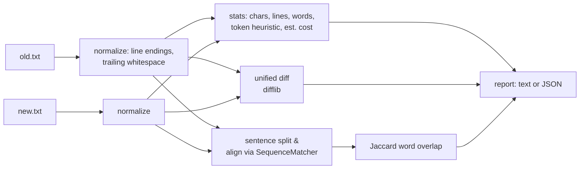

# promptdiff

Diff two LLM system prompts like code — stats, token/cost deltas, sentence-level
change summaries, overlap score, and a unified diff. Offline, zero API keys.

When you iterate on a system prompt, `promptdiff` answers the questions that
matter before you ship: *what actually changed? how many tokens did it cost me?
how similar is the new version?*

```bash
python -m promptdiff v1.txt v2.txt
```

```text
promptdiff: v1.txt -> v2.txt

Stats (tokens are heuristic estimates):
                                 chars   lines   words  tokens   est $/1k req*
  v1.txt                            232       6      38      52   $   0.1560
  v2.txt                            402       8      62      84   $   0.2520

Deltas: tokens +32, chars +170, lines +2, est $/1k req +0.0960
Jaccard word overlap: 58.33%

Changes: 2 added, 0 removed, 1 rewritten sentences
  [+] Ask one clarifying question when the request is ambiguous.
  [+] Prefer small, focused functions.
  [~] Write clean, idiomatic code with type hints.  ->  Write clean, idiomatic code with type hints and docstrings.

Unified diff:
--- v1.txt
+++ v2.txt
@@ ...
```

## Installation

Requires Python 3.10+. No runtime dependencies.

```bash
git clone https://github.com/sulaimanvesal/promptdiff.git
cd promptdiff
pip install -r requirements.txt   # pytest only
```

## Usage

```bash
# Human-readable report
python -m promptdiff old.txt new.txt

# Machine-readable report (unified diff included as a string field)
python -m promptdiff old.txt new.txt --json

# Custom input price for cost estimates ($/M input tokens)
python -m promptdiff old.txt new.txt --rate 1.25

# Skip the unified diff section for very large prompts
python -m promptdiff old.txt new.txt --no-diff
```

### Library use

```python
from promptdiff import analyze

report = analyze(open("v1.txt").read(), open("v2.txt").read(), "v1", "v2")
print(report["delta_tokens"], report["jaccard_similarity"])
print(report["changes"]["rewritten"])
```

## How it works



Pipeline:

1. **Normalize** both files (line endings, trailing whitespace) so cosmetic
   differences don't pollute the diff.
2. **Stats**: chars, lines, words, token estimate (documented whitespace/
   punctuation heuristic — good enough for iteration, not billing), and an
   estimated input cost at your `$` / M-token rate.
3. **Unified diff** via `difflib` for line-level review.
4. **Sentence alignment** via `difflib.SequenceMatcher`: reports added,
   removed, and *rewritten* sentences (rewrites = 1:1 replacements with
   ≥ 60% word overlap, shown as `old → new`).
5. **Jaccard similarity** over lowercased word sets — one number for "how
   much of this prompt survived the edit".

## Testing

```bash
pytest -q
python demo/demo.py
```

## Token estimates

Token counts use a fast heuristic, not a real tokenizer: words and punctuation
are counted and scaled (≈ 1 token per 0.75 words for English prose). It is
meant for comparing *deltas* between prompt versions, not for billing.
Install [tiktoken](https://github.com/openai/tiktoken) if you need exact counts.

## License

MIT — see [LICENSE](LICENSE).
